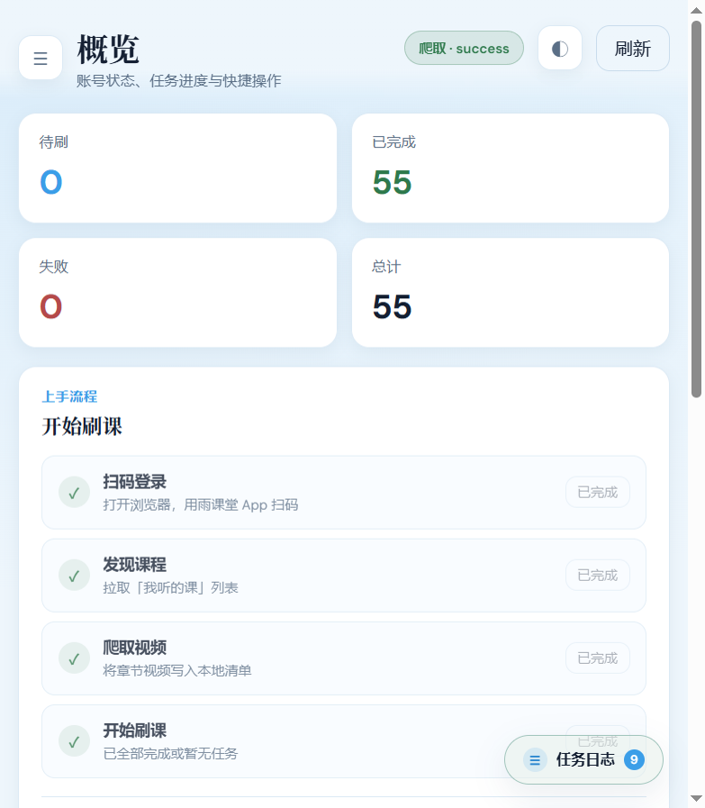
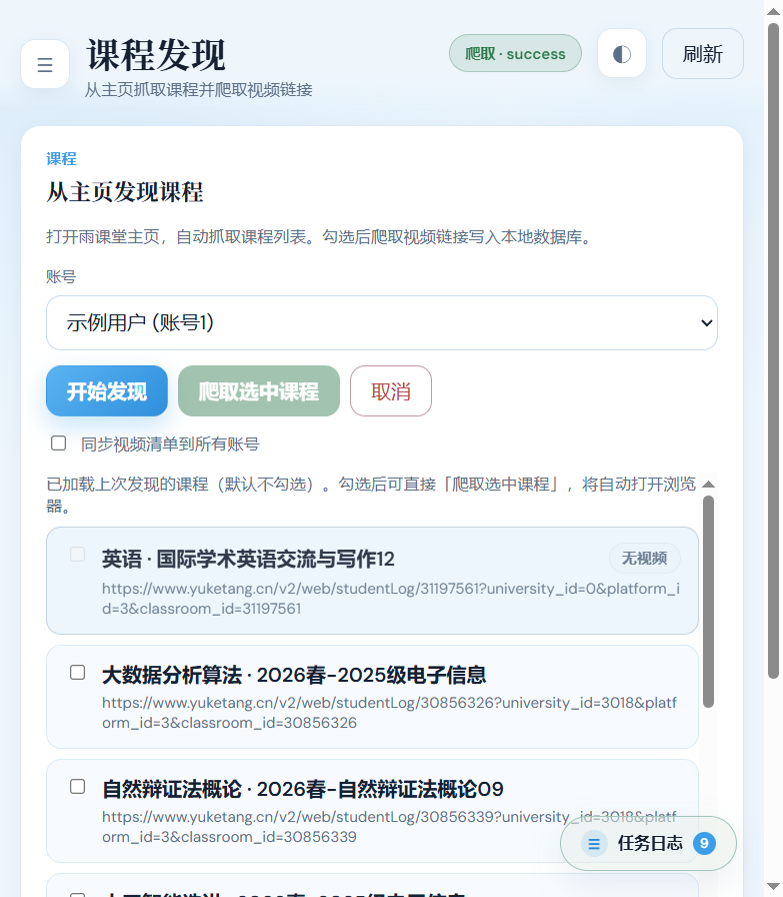
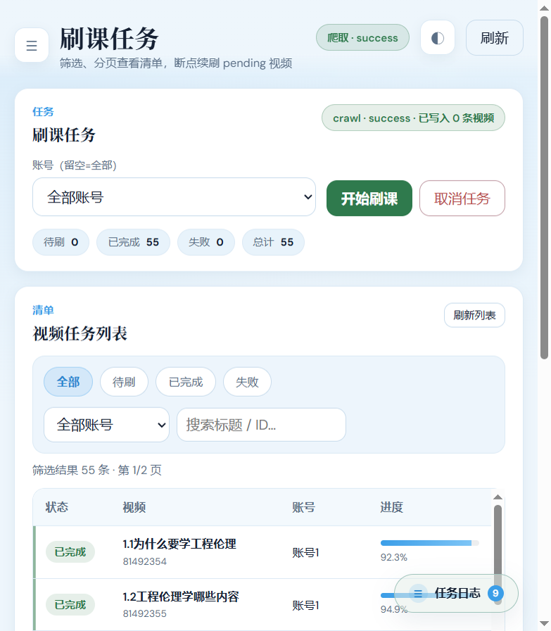
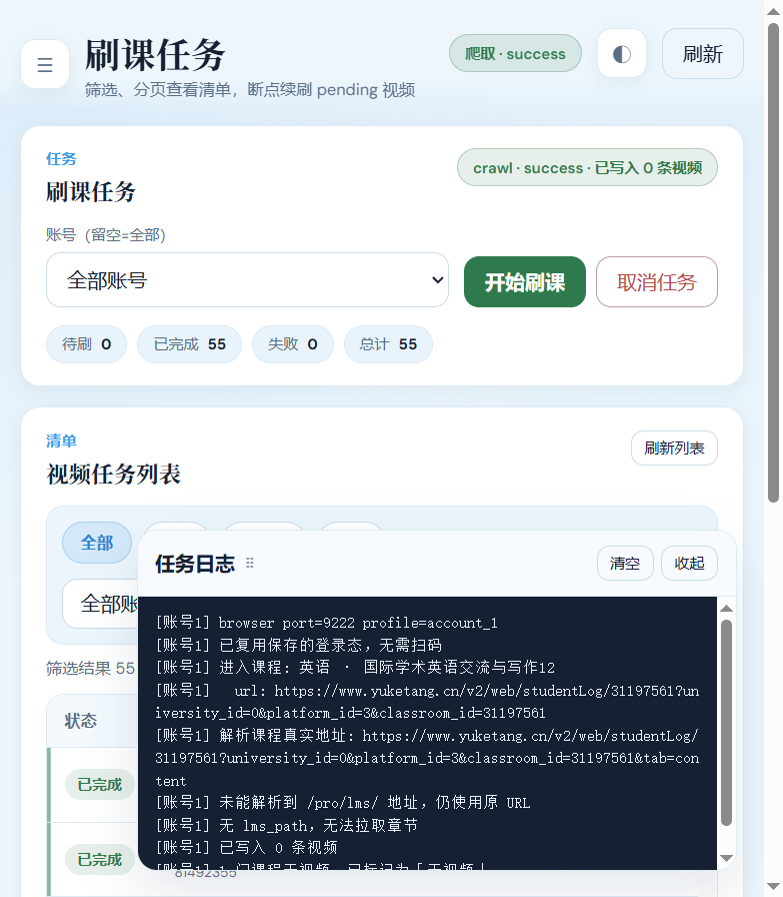
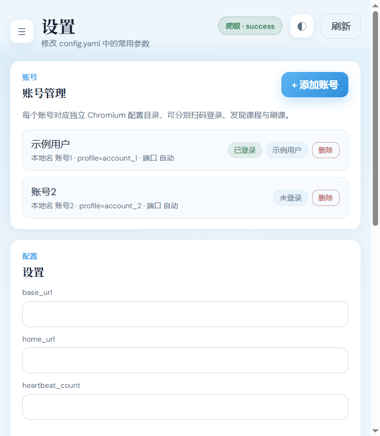

# 雨课堂通用刷课工具 (yuketang-bot)

可复用的雨课堂自动刷课工具，支持：

- **本地网页控制台**（推荐）：浏览器操作扫码登录、发现课程、刷课与实时日志
- CLI：`login` / `discover` / `run` / `status`
- SQLite 断点续刷，多账号 profile 隔离
- 自动跳过已看完视频，自动标记无视频课程

参考 Binggo 的本机控制台形态：仅绑定 `127.0.0.1`，数据不离开本机。

## 安装

```bash
pip install -r requirements.txt
```

复制配置并按需修改：

```bash
copy config.example.yaml config.yaml   # Windows
```

## 网页控制台（推荐）

```bash
python main.py web
# 或指定端口
python main.py web --port 18765
# 不自动打开浏览器
python main.py web --no-browser
```

浏览器访问 `http://127.0.0.1:18765/`：

1. **扫码登录**：打开 Chromium → 手机扫码 → 点「我已扫码」
2. **课程发现**：从主页抓取课程 → 勾选 → 爬取视频链接入库
3. **刷课任务**：开始刷课，右侧/下方任务日志实时推送（SSE）
4. **设置**：修改 base_url / home_url / 账号 / 心跳参数

## 功能截图

> 以下截图中的昵称已替换为「示例用户」，仅作功能演示。

### 概览



### 课程发现（自动标记无视频课程）



### 刷课任务清单



### 实时任务日志



### 账号与设置



## CLI 用法

```bash
python main.py login
python main.py discover
python main.py run
python main.py run --account 账号1
python main.py status
python main.py reset --course <course_url>
```

## 配置说明

见 `config.example.yaml`：

| 字段 | 说明 |
|------|------|
| `base_url` | 雨课堂主站或学校子站 |
| `home_url` | 课程列表主页 |
| `accounts` | 多账号，每个独立 browser profile |
| `loop` | 心跳刷课参数 |
| `db_path` | SQLite 任务库路径 |
| `profiles_root` | 浏览器 profile 目录 |

## 项目结构

```
yuketang-bot/
├── main.py
├── config.yaml
└── yuketang_bot/
    ├── browser.py / discover.py / api.py / runner.py / store.py
    └── web/                 # 本地控制台
        ├── app.py           # FastAPI
        ├── jobs.py          # 后台任务 + SSE
        └── static/          # SPA 前端
```

## 依赖

- Python 3.8+
- requests / DrissionPage / PyYAML / FastAPI / Uvicorn
- Windows 优先（空格播放依赖窗口置前）

## 打包成 exe（Windows）

安装依赖后执行：

```bash
pip install -r requirements.txt
python build.py
```

打包完成后在 `dist/` 目录生成：

```
dist/
├── yuketang-bot.exe
└── config.example.yaml
```

**使用方法：**

1. 首次运行前，把 `config.example.yaml` 复制为 `config.yaml`（或双击 exe 后自动复制）。
2. 双击 `yuketang-bot.exe`：
   - 自动在后台启动本地控制台服务
   - 自动打开浏览器访问 `http://127.0.0.1:18765/`
   - 在系统托盘显示图标，右键可「打开控制台」/「退出」
3. 退出时右键托盘图标选择「退出」即可。

> 注意：打包后的 exe 首次启动会较慢（PyInstaller 单文件解压），请耐心等待托盘图标出现。
